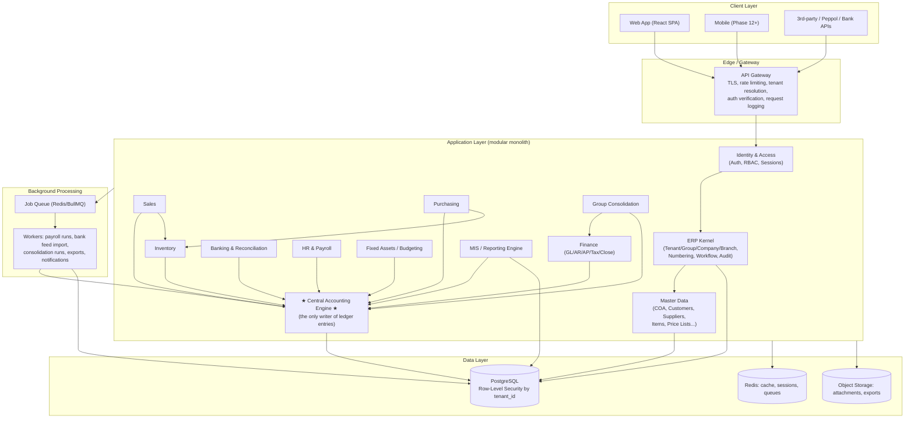
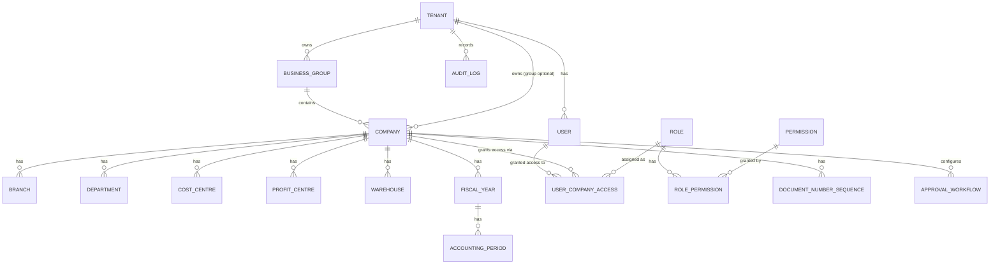
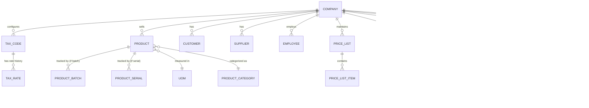
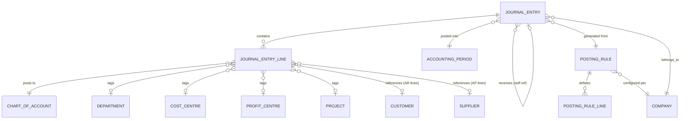
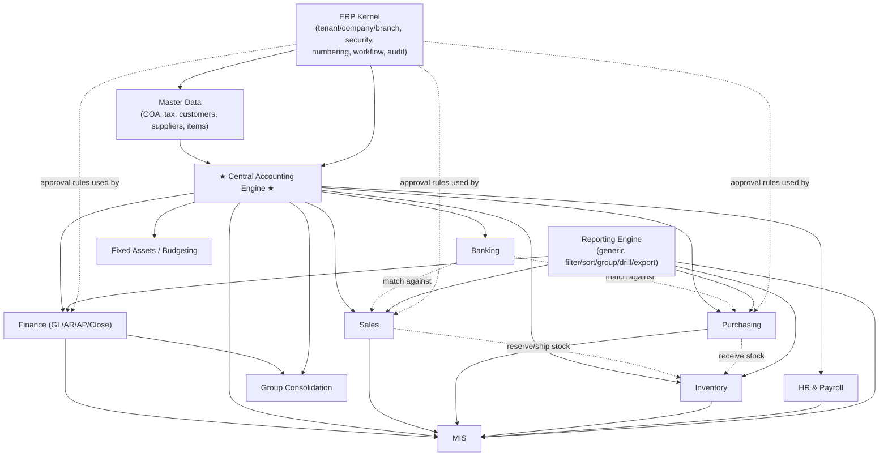

# OmniERP — System Architecture

**Status:** Design for approval. No implementation has started. This document
covers items A–L requested before Phase 1 begins, plus how every module talks
to the Central Accounting Engine.

---

## Table of contents

- [A. Complete system architecture](#a-complete-system-architecture)
- [B. Multi-tenant architecture](#b-multi-tenant-architecture)
- [C. Database / entity relationship design](#c-database--entity-relationship-design)
- [D. Central Accounting Engine design](#d-central-accounting-engine-design)
- [E. Module dependency map](#e-module-dependency-map)
- [F. API architecture](#f-api-architecture)
- [G. Security / RBAC architecture](#g-security--rbac-architecture)
- [H. MIS architecture](#h-mis-architecture)
- [I. Group consolidation architecture](#i-group-consolidation-architecture)
- [J. Development roadmap](#j-development-roadmap)
- [K. Recommended technology stack](#k-recommended-technology-stack)
- [L. Risks and scalability considerations](#l-risks-and-scalability-considerations)

---

## A. Complete system architecture

OmniERP is a **modular monolith with hard internal module boundaries**, not a
microservices system on day one. Every module (Sales, Purchasing, Inventory,
Banking, Payroll, Assets, MIS…) is a separate codebase module with its own
tables and its own API surface, but they all run in one deployable unit that
talks to one PostgreSQL cluster. This is deliberate: at SME/mid-market SaaS
scale, a modular monolith is faster to build, cheaper to run and easier to
keep transactionally consistent than microservices — and because the module
boundaries are enforced in code from day one, any module can be extracted
into its own service later **without a rewrite**, if/when a specific tenant's
scale or a specific team's org chart demands it (this is called out again in
[Risks](#l-risks-and-scalability-considerations)).



**Layers:**

1. **Client layer** — React SPA (primary), later mobile/native, plus external
   system integrations (Peppol e-invoicing, bank APIs, attendance devices —
   Phase 12).
2. **Edge/Gateway** — single entry point: TLS termination, JWT verification,
   tenant/company context resolution, rate limiting, structured request
   logging. No module is reachable except through the gateway.
3. **Application layer** — the modular monolith. Each module is an isolated
   folder/package with its own controllers, services, and repository layer.
   Modules **never** reach into another module's tables directly — they call
   the other module's service interface (in-process function calls today,
   trivially replaceable with network calls if a module is later extracted).
4. **Background processing** — anything heavy, slow, or naturally batched
   (payroll runs, bank statement parsing, consolidation runs, large report
   exports, scheduled recurring journals) goes through a job queue so the API
   request path stays fast and the accounting engine isn't blocked by
   long-running jobs.
5. **Data layer** — one PostgreSQL cluster (with a path to per-tenant
   isolation for large tenants, see [B](#b-multi-tenant-architecture)), Redis
   for cache/sessions/queues, and object storage for attachments/exports.

---

## B. Multi-tenant architecture

### Hierarchy

```
Platform
 └─ Tenant (the paying SaaS customer / account)
     └─ Business Group (optional — a tenant may have exactly one company and no group)
         └─ Legal Company (its own books, fiscal year, currency, tax registration)
             └─ Branch
                 └─ Department
                 └─ Cost Centre
                 └─ Profit Centre
                 └─ Warehouse
     └─ Users (tenant-scoped identity, access is granted per company/branch)
```

Every transactional and master-data table that is not truly platform-global
(currencies, country tax templates, permission catalogue) carries at least
`tenant_id` and `company_id`; documents also carry `branch_id`,
`department_id`, `cost_centre_id`, `profit_centre_id`, `warehouse_id` where
relevant (nullable — not every doc has all dimensions).

### Isolation strategy: pooled by default, siloed by exception

We use a **hybrid pool/silo model**, which is standard SaaS practice:

| Tier | Storage model | Who |
|---|---|---|
| **Pool (default)** | Shared PostgreSQL database, shared schema, every table has `tenant_id`, enforced by **Postgres Row-Level Security (RLS)** | The vast majority of SME tenants |
| **Silo (opt-in / enterprise)** | Same schema, but a dedicated schema or dedicated database for one large tenant, routed to by a `tenant_routing` lookup at connection time | Large group tenants, tenants with contractual data-residency requirements, or tenants that outgrow the pool's noisy-neighbour limits |

Both tiers run **the same application code** — silo tenants are just a
different connection string resolved at request time. This is the escape
hatch that avoids ever having to re-architect for a single big customer.

### Enforcement — defense in depth, not just app-layer filtering

Tenant isolation is treated as a security boundary, not a convenience filter,
so it is enforced at **two independent layers**:

1. **Application layer:** every authenticated request resolves
   `tenant_id`/`company_id` from the verified JWT + the user's granted
   access list — **never** from a URL param, request body, or client header
   alone. A user's JWT contains their `tenant_id` and the list of
   `company_id`s they're allowed to act on; the gateway rejects any request
   whose `X-Company-Id` isn't in that list before it reaches a module.
2. **Database layer (the real backstop):** every tenant-scoped table has
   `ENABLE ROW LEVEL SECURITY` with a policy such as:

   ```sql
   CREATE POLICY tenant_isolation ON sales_invoices
     USING (tenant_id = current_setting('app.tenant_id')::uuid);
   ```

   Every DB connection, at the start of a request/transaction, executes
   `SET LOCAL app.tenant_id = '<uuid>'` (and `app.company_ids` for
   company-level filtering) from the trusted server-side context — never
   from client input. This means **even a bug in application code that
   forgets a `WHERE tenant_id = …` clause cannot leak cross-tenant rows**,
   because Postgres itself refuses to return them. This is the single most
   important control in the whole platform and is treated as such: it is
   covered by automated tests in CI that attempt cross-tenant reads and
   assert they return zero rows (see [Risks](#l-risks-and-scalability-considerations)).

### Tenant vs. Group vs. Company — why the hierarchy exists

- **Tenant** = the commercial/billing entity and the security boundary. All
  isolation is ultimately keyed on `tenant_id`.
- **Business Group** = an optional organizational grouping *within* a tenant,
  purely for consolidated MIS/reporting. It has no accounting books of its
  own.
- **Legal Company** = the actual accounting entity: its own Chart of
  Accounts, fiscal year, base currency, tax registration, and ledger. This
  is the unit double-entry accounting is scoped to.
- **Branch/Department/Cost Centre/Profit Centre/Warehouse** = sub-dimensions
  *within* a company used for operational scoping and analytical drill-down,
  not separate books.

---

## C. Database / entity relationship design

PostgreSQL is the system of record. Principles: every FK enforced (no
orphaned records), money columns are `NUMERIC`, every transactional table has
`tenant_id` + audit columns (`created_by`, `created_at`, `updated_by`,
`updated_at`), soft-delete only where a business reason requires it
(otherwise hard delete on drafts, and posted records are simply never
deleted). Full illustrative DDL for the kernel + accounting core is in
[`schema/kernel-and-accounting.sql`](schema/kernel-and-accounting.sql) — this
is a **design reference**, not an applied migration.

### Kernel entities



### Master data entities



### Central Accounting Engine entities (the core of the whole system)



Key tables:

| Table | Purpose |
|---|---|
| `journal_entries` | Header: company, branch, period, source module/doc, status (`draft→submitted→approved→posted→cancelled/reversed`), currency, FX rate, `reversal_of_id` |
| `journal_entry_lines` | One row per debit/credit line: account, debit, credit, base-currency amount, all dimension tags, optional customer/supplier reference for subledger tie-out |
| `posting_rules` / `posting_rule_lines` | **Data-driven mapping** from a business event (`SALES_INVOICE_POSTED`, `SUPPLIER_PAYMENT_POSTED`, …) to which control accounts get debited/credited, per company — see [D](#d-central-accounting-engine-design) |
| `gl_account_balances` | Materialized running balance per account × period × dimension, maintained incrementally on every post — this is what reports actually query, so a Trial Balance never has to sum millions of lines live |
| `document_number_sequences` | Per-company/branch/doc-type numbering (invoice numbers, JE numbers, etc.), atomic increment |

### Full entity groupings (summary — see SQL file for columns/FKs)

- **Kernel:** `tenants`, `business_groups`, `companies`, `branches`,
  `departments`, `cost_centres`, `profit_centres`, `warehouses`, `users`,
  `roles`, `permissions`, `role_permissions`, `user_company_access`,
  `fiscal_years`, `accounting_periods`, `currencies`, `exchange_rates`,
  `document_number_sequences`, `approval_workflows`, `approval_steps`,
  `approval_requests`, `audit_logs`, `attachments`, `notifications`.
- **Master data:** `chart_of_accounts`, `account_groups`, `tax_codes`,
  `tax_rates`, `payment_terms`, `banks`, `bank_accounts`, `customers`,
  `customer_contacts`, `suppliers`, `employees`, `products`,
  `product_categories`, `brands`, `uoms`, `uom_conversions`, `price_lists`,
  `price_list_items`, `salespersons`, `projects`, `product_batches`,
  `product_serials`.
- **Accounting engine:** `journal_entries`, `journal_entry_lines`,
  `posting_rules`, `posting_rule_lines`, `gl_account_balances`.
- **Sales:** `quotations`, `quotation_lines`, `sales_orders`,
  `sales_order_lines`, `deliveries`, `delivery_lines`, `sales_invoices`,
  `sales_invoice_lines`, `customer_receipts`, `credit_notes`, `debit_notes`,
  `customer_credit_limits`.
- **Purchasing:** `purchase_requests`, `purchase_orders`,
  `purchase_order_lines`, `goods_receipts`, `goods_receipt_lines`,
  `supplier_invoices`, `supplier_invoice_lines`, `supplier_payments`,
  `purchase_returns`.
- **Inventory:** `stock_moves` (single unified movement ledger for
  in/out/transfer/adjustment — this is the inventory analogue of
  `journal_entries`), `stock_balances`, `stock_counts`,
  `stock_count_lines`, `reorder_rules`.
- **Banking:** `bank_statements`, `bank_statement_lines`, `bank_matching_rules`,
  `reconciliation_matches`.
- **HR/Payroll:** `employees` (master, shared), `attendance_records`,
  `leave_requests`, `salary_structures`, `payroll_runs`, `payslips`,
  `statutory_contributions`.
- **Assets & Budgeting:** `fixed_assets`, `depreciation_schedules`,
  `depreciation_entries`, `budgets`, `budget_lines`.
- **Consolidation:** `intercompany_transactions`, `elimination_rules`,
  `consolidation_runs`, `consolidated_trial_balances`.

---

## D. Central Accounting Engine design

This is the heart of OmniERP, and the rule from the brief is absolute: **no
module writes to the ledger itself.** Every module calls one internal
interface:

```
AccountingEngine.postEvent(AccountingEvent) → JournalEntry (Draft)
```

### Why events, not raw debit/credit lines

If Sales, Purchasing and Payroll each constructed their own debit/credit
lines, the mapping of "which GL account does an AR customer's invoice hit"
would be duplicated (and would drift) across modules — exactly what the
brief prohibits. Instead:

1. A module raises a **normalized accounting event** describing *what
   happened in business terms* — e.g. `SALES_INVOICE_POSTED` with amount,
   tax breakdown, customer, currency, dimensions — **not** GL account
   numbers.
2. The engine looks up a **Posting Rule** for
   `(company_id, event_type)` — a configuration row, not code — that says
   which control accounts to hit (e.g. "debit the customer's Receivables
   control account, credit Sales Revenue by account-group mapping of the
   item, credit Output Tax account for the tax code used").
3. The engine resolves those account references, builds a balanced
   `JournalEntry` + `JournalEntryLine[]`, converts to base currency using the
   period-appropriate FX rate, and validates debits = credits before
   anything is written.

This means **the only place accounting logic lives is the posting-rule
configuration + the engine that interprets it** — Sales/Purchasing/Payroll
code never mentions a GL account number.

### Example mappings (as configured Posting Rules, not hardcoded per module)

| Event | Debit | Credit |
|---|---|---|
| `SALES_INVOICE_POSTED` | Accounts Receivable (control) | Sales Revenue, Output Tax |
| `PURCHASE_INVOICE_POSTED` | Expense/Inventory, Input Tax | Accounts Payable (control) |
| `CUSTOMER_RECEIPT_POSTED` | Bank | Accounts Receivable |
| `SUPPLIER_PAYMENT_POSTED` | Accounts Payable | Bank |
| `PAYROLL_RUN_POSTED` | Salary Expense | Salary Payable, Statutory Payables |
| `GOODS_RECEIPT_POSTED` | Inventory | GR/IR Clearing |
| `DELIVERY_POSTED` (COGS recognition) | Cost of Goods Sold | Inventory |

### Lifecycle and immutability

```
Draft → Submitted → Approved → Posted → (Cancelled | Reversed)
```

- **Draft/Submitted/Approved** are mutable and belong to the source module's
  own workflow (e.g. a Sales Invoice can be edited while in Draft).
- **Posted** is the only status that has a corresponding `journal_entries`
  row visible to the ledger, and **posted entries are never edited**. A
  correction is always a new **Reversal** (an exact mirror entry, linked via
  `reversal_of_id`) or a new **Adjustment Entry** — never an `UPDATE` on a
  posted row. This is enforced with a DB trigger that rejects any `UPDATE`
  to `journal_entry_lines` where the parent status is `posted`.
- **Period control:** the engine refuses to post into a `accounting_period`
  whose status is `closed` or `locked`, full stop — reopening a closed
  period is a separate, permissioned, audited action, not a side effect of
  posting.

### Synchronous vs. asynchronous posting

- **Interactive documents** (invoice, receipt, payment) post **synchronously,
  in the same DB transaction** as the source document's own status change —
  if the ledger write fails, the source document's status change rolls back
  too. In a modular monolith this is a normal in-process function call
  inside one transaction; nothing exotic is needed.
- **Batch/heavy events** (a payroll run generating hundreds of payslip
  journal entries, a recurring-journal scheduler, a bank feed auto-posting
  hundreds of matched transactions) go through the job queue: the worker
  calls the same `AccountingEngine.postEvent` API per item, inside its own
  transaction per item, so a single bad row doesn't roll back an entire
  payroll run.

### How the engine notifies the rest of the system

After a `JournalEntry` reaches `Posted`, the engine emits a domain event
(`JournalPosted`) via a transactional outbox (a row written in the same
transaction, then relayed to the queue) that:

- Updates `gl_account_balances` incrementally (so reports stay fast).
- Notifies MIS's cache-refresh worker for the affected company/period.
- Notifies Inventory, if the event was a delivery/goods-receipt, to
  finalize stock valuation.

No module ever reads another module's journal directly to "figure out" a
balance — everything downstream is driven off this one event stream, which
keeps the engine the single source of truth without becoming a bottleneck
other modules have to poll.

### Sequence: Sales Invoice → GL

```mermaid
sequenceDiagram
    participant U as User
    participant S as Sales Module
    participant WF as Approval Workflow
    participant E as Accounting Engine
    participant DB as PostgreSQL

    U->>S: Submit Sales Invoice
    S->>WF: Evaluate approval rules (amount, company, role)
    WF-->>S: Auto-approved (below threshold)
    S->>E: postEvent(SALES_INVOICE_POSTED, {...})
    E->>DB: Load posting_rule for (company, event_type)
    E->>DB: Resolve accounts (AR control, Revenue, Output Tax)
    E->>DB: BEGIN; validate period open; insert journal_entry (posted); insert lines; commit
    E-->>S: JournalEntry reference
    S->>DB: Mark invoice Posted, store journal_entry_id
    E->>DB: Update gl_account_balances (incremental)
    E-->>MIS: emit JournalPosted event
```

---

## E. Module dependency map



Reading it: arrows point from "depended upon" to "depender" — i.e. **Kernel
→ Master Data → Central Accounting Engine** is the non-negotiable base
every other module sits on. **Sales/Purchasing/Inventory/Banking/HR/Assets
never depend on each other's internal tables** — where they interact (Sales
reserving stock, Bank matching a Sales invoice) they call each other's public
service interface, and all of them post accounting through the Engine only.
**MIS and Consolidation are read-only consumers** of the Engine's data — they
never write journal entries and never duplicate ledger rows; see
[H](#h-mis-architecture) and [I](#i-group-consolidation-architecture). The
**Workflow engine and Reporting engine are cross-cutting** — used by many
modules, owned by none.

---

## F. API architecture

- **Style:** versioned REST, `/api/v1/...`, resource-oriented
  (`/sales-invoices/{id}`, `/purchase-orders/{id}`). GraphQL is not adopted
  initially — REST + a generic Reporting Engine covers the filter/sort/group
  needs in [Reporting](#h-mis-architecture) without the added complexity of a
  GraphQL layer on top of a strict RBAC/RLS model.
- **Tenant/company context:** resolved server-side from the JWT
  (`tenant_id`, granted `company_id`s) plus a required `X-Company-Id` header
  for the "active company" of the request. **Tenant/company IDs never
  appear as trusted input in the URL or body** — if a body includes a
  `company_id`, the gateway validates it against the JWT's grant list and
  rejects on mismatch, rather than trusting it.
- **Idempotency:** all POST endpoints that cause a posting side-effect
  (invoice submission, payment posting, payroll run trigger) require an
  `Idempotency-Key` header; a retried request with the same key returns the
  original result instead of double-posting. This matters more in an ERP
  than almost any other kind of app.
- **Async operations:** heavy operations (payroll run, consolidation run,
  large export) return `202 Accepted` + a job id immediately; the client
  polls `/jobs/{id}` or receives a notification on completion — the request
  thread is never held open for a background job.
- **Bulk endpoints:** dedicated bulk/import endpoints for master data
  (customers, items) and opening balances, distinct from the single-resource
  CRUD endpoints, so imports don't abuse the interactive API.
- **Internal module-to-module calls** are in-process service calls (not
  network hops) in the modular monolith, which is what keeps the
  synchronous accounting-engine transaction guarantee in
  [D](#d-central-accounting-engine-design) cheap. If a module is later
  extracted into its own service, this interface becomes the network
  contract with no change to callers.
- **Webhooks/integrations** (Peppol e-invoicing, bank feed APIs, attendance
  devices) are Phase 12 and are implemented as adapters that translate an
  external payload into the same internal events (e.g. a bank feed becomes
  `bank_statement_lines` rows, feeding the same reconciliation engine as a
  manually uploaded statement) — integrations never get a side door into the
  accounting engine.

---

## G. Security / RBAC architecture

- **Identity:** a `user` belongs to exactly one `tenant`. Access to specific
  companies/branches is granted explicitly via `user_company_access`
  (user × company × role), so a user at a group tenant can have different
  roles in different legal companies (e.g. Accountant in the Singapore
  entity, read-only in the Malaysia entity).
- **RBAC model:** `role` = named bundle of `permission`s;
  `permission` = `module.action` (e.g. `sales_invoice.approve`,
  `journal_entry.reverse`, `payroll.view_salary`). Roles are assigned per
  company (not globally), and can additionally be scoped to specific
  branches/departments/cost centres for org-chart-shaped restrictions (e.g.
  a branch manager role that only sees their own branch's data) — these
  scopes are merged into the same query filters that RLS already applies,
  so a restricted user's queries are filtered at the DB layer, not just
  hidden in the UI.
- **Authentication:** password + mandatory-option MFA (TOTP), short-lived
  JWT access tokens (~15 min) + rotating refresh tokens, server-side
  session/refresh-token revocation list (so "log out everywhere" and admin
  force-logout both work immediately rather than waiting for token expiry).
- **Sensitive data:** payroll salary figures, bank account numbers, national
  ID numbers get field-level access control (a permission check beyond
  "can view this record") and are encrypted at the column level in addition
  to disk-level encryption.
- **Audit trail:** append-only `audit_logs` table capturing user, timestamp,
  action (`create/edit/approve/post/cancel/reverse/delete/export/login/
  permission_change/config_change`), entity type + id, old value (JSON),
  new value (JSON), tenant, company. Audit rows are never updated or
  deleted by application code (enforced by DB grants — the app role has no
  `UPDATE`/`DELETE` privilege on that table at all, only `INSERT`), and
  financial audit rows are additionally hash-chained (each row includes a
  hash of the previous row) so tampering is detectable even by someone with
  raw DB access.
- **Tenant isolation** is a security control, not a filter — see
  [B](#b-multi-tenant-architecture) for the RLS-based enforcement, and
  [Risks](#l-risks-and-scalability-considerations) for how it's continuously
  verified in CI.

---

## H. MIS architecture

MIS is a **read-only analytical layer over the Central Accounting Engine's
data — it never duplicates a ledger entry.** Two things make this both fast
and correct at scale:

1. **Incrementally maintained summary tables.** Every time the engine posts
   a `JournalEntry`, it (asynchronously) updates `gl_account_balances` —
   pre-aggregated balances per account × period × company × branch ×
   department × cost centre × profit centre. MIS dashboards and standard
   financial reports query these summaries, not millions of raw
   `journal_entry_lines`. A nightly reconciliation job re-derives the
   summaries from raw lines and diffs against the incremental version, so
   drift is caught automatically rather than trusted blindly.
2. **A semantic mapping layer, not hardcoded formulas.** Because the core
   accounting engine is deliberately country/COA-neutral, "Revenue",
   "COGS", "Operating Expense" etc. for MIS purposes are derived from a
   tag on each `chart_of_accounts` row (`mis_category`), configured once
   per company at COA setup, not inferred by pattern-matching account
   names. Gross Profit, EBITDA, Net Profit, Working Capital and all KPIs
   (AR Days, AP Days, Inventory Days, Cash Conversion Cycle, margins) are
   then generic formulas over those tagged categories — the same formula
   works for a Singapore company and an India company with completely
   different Charts of Accounts.

**Drill-down** (`Group → Country → Company → Branch → Department → Cost
Centre → Account → Transaction`) is simply progressively-less-aggregated
filtering on the same fact table — because every dimension is a real column
on `journal_entry_lines`/`gl_account_balances`, drilling down never requires
a different query engine or a data-warehouse ETL step; it's the same
Reporting Engine ([F](#f-api-architecture)) with more filters applied.

**Actual vs. Budget / Period vs. Period / Variance** reuse the identical
summary tables — a budget is just another named series in `budget_lines`
compared against the same account/dimension keys, so variance reporting adds
no new data model, only a comparison query.

---

## I. Group consolidation architecture

Each legal company keeps its own complete, un-touched set of books — **no
consolidation logic ever writes into a subsidiary's ledger.** Consolidation
is a separate, computed presentation layer that reads from Finance/the
Engine:

1. A `consolidation_run` is started for a `business_group` + period +
   presentation currency.
2. It pulls each subsidiary's trial balance (from `gl_account_balances`,
   already company-scoped) and translates it to the presentation currency:
   P&L lines at the period-average rate, Balance Sheet lines at the
   period-closing rate, equity at historical rates — the FX method is
   configurable per the run, not hardcoded, since different jurisdictions'
   standards vary here.
3. **Intercompany transactions** (e.g. Singapore invoices Malaysia) are
   recorded in the normal Sales/Purchasing flow of each entity, but
   additionally tagged in `intercompany_transactions` (linking the mirrored
   pair). The consolidation run applies configured `elimination_rules`
   against those pairs and produces elimination entries **that exist only
   inside the consolidation output**, never posted back into either
   company's ledger.
4. The result (`consolidated_trial_balances` + generated Consolidated P&L /
   Balance Sheet / Cash Flow) is stored per run for audit and repeatability,
   and a pre-consolidation **intercompany mismatch report** is required to
   be clean (or explicitly overridden with a note) before a run is marked
   final — this is the main real-world failure mode in consolidation
   (mismatched intercompany balances) and it's designed to be caught, not
   silently eliminated wrong.

This is explicitly designed so that **Phase 11 adds consolidation without
touching Phases 1–10 at all** — consolidation only needs read access to
`gl_account_balances`, `exchange_rates`, and the intercompany link table,
all of which already exist from Phase 3–4 onward.

---

## J. Development roadmap

Each phase has a concrete exit criterion — the next phase doesn't start
until the current one's exit criterion is demonstrably met (migrations
applied, module usable end-to-end for its scope, tests passing).

| Phase | Scope | Exit criterion |
|---|---|---|
| **1** | Multi-tenant kernel: tenants, groups, companies, branches, departments, cost/profit centres, warehouses, users, roles, permissions, RLS policies, auth (login, MFA, sessions) | A second tenant's user cannot see the first tenant's data under any code path, verified by an automated cross-tenant test |
| **2** | Database schema + master data: COA, tax codes, customers, suppliers, employees, products, UOM, price lists, projects — all migrations | Master data CRUD works per company with full tenant/company scoping and audit logging |
| **3** | Central Accounting Engine: `journal_entries`/`journal_entry_lines`, posting rules, period control, reversal, `gl_account_balances` | A manual journal entry can be posted, reversed, and shows correctly in a Trial Balance; posted entries are provably immutable |
| **4** | Finance: GL, JE UI, AR, AP, Cash/Bank, period close, core financial reports (TB, GL, P&L, BS) | A full manual accounting cycle (open period → post entries → close period → produce P&L/BS) works for one company |
| **5** | Sales + Purchasing, both calling the Engine via posting events, no direct ledger writes from either module | Quotation → Order → Delivery → Invoice → Receipt and PR → PO → GRN → Supplier Invoice → Payment both flow through to correct GL postings |
| **6** | Inventory: unified `stock_moves`, valuation, batch/serial, transfers, counts, integrated with Sales/Purchasing | Stock levels and valuation stay correct across a full sales+purchase cycle, deliveries triggering COGS entries automatically |
| **7** | Banking & reconciliation: statement import, matching engine (confidence scoring), reconciliation posting | A bank statement import auto-suggests matches at high confidence and requires review below threshold, and approved matches post/reconcile correctly |
| **8** | HR & Payroll, payroll run posting through the Engine | A payroll run for a company produces correct payslips and one (or per-employee) journal entries via the Engine, not bespoke payroll GL code |
| **9** | Fixed Assets + Budgeting | Depreciation schedules post automatically per period; budget vs actual variance reports work |
| **10** | MIS & Management Dashboard, Reporting Engine generalized | Drill-down from Group to transaction works live on real data, KPIs match manually computed values |
| **11** | Group Consolidation | A multi-currency 2-company group produces a consolidated P&L/BS with intercompany eliminations that reconcile to zero |
| **12** | Integrations: Peppol e-invoicing, bank APIs, attendance devices, country localization packs beyond the first 1–2 | Each integration is an adapter with zero changes to the core accounting engine |

---

## K. Recommended technology stack

| Layer | Choice | Why |
|---|---|---|
| Backend | **Node.js + NestJS (TypeScript)** | NestJS's module system maps directly onto the module boundaries in [E](#e-module-dependency-map) (Sales module, Inventory module, etc. as literal Nest modules with enforced import boundaries); TypeScript gives compile-time safety across a large domain model. *(Java/Spring Boot or .NET are equally valid if the team's background favors them — the architecture doesn't depend on the language, only on the module-boundary discipline.)* |
| Database | **PostgreSQL** (managed, e.g. RDS/Cloud SQL, or self-hosted) | Row-Level Security for tenant isolation, mature partitioning, strong transactional guarantees needed for double-entry accounting |
| DB access / migrations | **Prisma or TypeORM** for queries + a dedicated SQL migration tool (**node-pg-migrate** or **Flyway**) for RLS policies/triggers that ORMs don't model well | Keep generated migrations for schema, hand-written SQL for RLS/triggers/partitioning, both version-controlled |
| Cache / Queue | **Redis + BullMQ** | Session cache, permission cache, exchange-rate cache, and the background job queue for payroll runs, bank imports, consolidation runs, exports |
| Search | Postgres full-text search initially; **Meilisearch/Elasticsearch** later if global search volume demands it | Avoid operating a search cluster before it's needed |
| Object storage | **S3-compatible storage** (S3 / GCS / MinIO self-hosted) | Attachments, generated PDF/Excel exports |
| Frontend | **React + TypeScript**, an enterprise-grade component/data-grid library (e.g. AG Grid or TanStack Table for dense ERP tables), **TanStack Query** for server state | Matches the "professional enterprise ERP, not generic dashboard" requirement in the brief — dense tables, filters, drill-down are first-class, not an afterthought |
| Auth | Custom auth service or **Keycloak** (OIDC), issuing JWTs consumed by the gateway | MFA, session/refresh-token revocation, SSO-ready for enterprise tenants later |
| Infra | **Docker** containers; **Kubernetes** once tenant/traffic scale warrants it (a single well-sized container/VM is enough at launch) | Avoid over-engineering infra before there's load to justify it, but keep the container boundary clean from day one |
| Observability | Structured logs, **OpenTelemetry** tracing, **Prometheus/Grafana** metrics, **Sentry** errors | Every posting/reversal/approval is traceable end-to-end, essential for an accounting system |
| CI/CD | **GitHub Actions**, migrations gated behind review, staging before prod | Standard, no proprietary lock-in |

Stack is deliberately **open-source-first and cloud-agnostic** — nothing
here requires a specific cloud vendor's proprietary managed service, which
matters for a platform that may need to satisfy data-residency requirements
per tenant/country.

---

## L. Risks and scalability considerations

| Risk | Mitigation |
|---|---|
| **Cross-tenant data leak** (the single worst possible failure for a multi-tenant SaaS) | Two independent enforcement layers (app + Postgres RLS, [B](#b-multi-tenant-architecture)); CI includes automated adversarial tests that attempt cross-tenant reads/writes for every new tenant-scoped table and fail the build if any succeed |
| **Central Accounting Engine becomes a bottleneck or single point of failure** | Stateless engine service, horizontally scalable behind the API layer; synchronous path only for interactive single-document postings (cheap, in-transaction); heavy batch postings (payroll, bulk bank matching) go through the queue so they can't block interactive traffic |
| **`journal_entry_lines` growing very large** (this table grows forever and never gets smaller) | Table partitioning by `company_id` + fiscal year from the start; reporting reads from `gl_account_balances` summaries, not raw lines, so table size doesn't degrade report latency over time |
| **Country tax/localization scope creep polluting the core engine** | Hard architectural rule: localization lives in per-country tax-code/tax-rate configuration and country-specific report templates only — the posting engine and JE schema are country-neutral by construction, so adding e.g. Saudi e-invoicing never touches Phase 3's engine code |
| **Approval workflow misconfiguration stalling documents indefinitely** | Workflow monitoring (aging alerts on pending approvals), a mandatory fallback approver per rule, and an audit trail on every workflow config change |
| **Consolidation errors from unmatched intercompany balances** | Mandatory pre-run intercompany mismatch report; a run cannot be marked final with unresolved mismatches without an explicit, audited override |
| **Sensitive data exposure** (payroll, bank details, national IDs) | Field-level permission checks in addition to record-level RLS; column-level encryption for the most sensitive fields; payroll audit logging is stricter than general audit logging |
| **Legacy data migration** (customers importing from Tally/Excel/other ERPs) | Dedicated bulk-import endpoints and mapping tools (opening balances, COA mapping) treated as a first-class feature, not an afterthought, needed well before Phase 12 |
| **Vendor lock-in / infra cost at scale** | Open-source-first stack, containerized, no proprietary managed-service dependency baked into the core design |
| **Team/org scaling past what a modular monolith comfortably serves** | Because module boundaries are enforced in code from Phase 1 (own tables, own service interface, no cross-module table access), any single module (e.g. Payroll, or Inventory) can be extracted into its own deployable service later with no core rewrite — this is deliberately deferred, not pre-built, to avoid the operational cost of microservices before there's a real scaling reason for them |

---

## How every module talks to the Central Accounting Engine (summary)

This is called out once more here because it's the rule the entire design
hangs on:

1. A module's document reaches a status that has a financial consequence
   (invoice submitted for posting, payment approved, payroll run finalized).
2. The module calls `AccountingEngine.postEvent(eventType, businessData)` —
   it passes *business facts* (amounts, tax, customer/supplier, dimensions),
   **never** GL account numbers.
3. The engine resolves the correct accounts from that company's configured
   **Posting Rules** (data, not code), builds a balanced journal entry,
   validates the period is open, and writes it — synchronously in the same
   transaction for interactive documents, via the job queue for batch
   operations.
4. The module stores the returned `journal_entry_id` as a reference and
   flips its own document to `Posted`. It never reads or writes
   `journal_entry_lines` directly for any other purpose.
5. The engine emits a `JournalPosted` event that MIS, Inventory valuation,
   and consolidation summaries subscribe to — nothing downstream re-derives
   the ledger by re-reading the source module.

This is the one rule that guarantees the brief's hardest requirement: **one
controlled double-entry accounting engine, zero duplicated posting logic,
anywhere in the system.**

---

**Awaiting approval to begin Phase 1** (Multi-Tenant Kernel + Authentication
+ RBAC), per the roadmap in [J](#j-development-roadmap).
